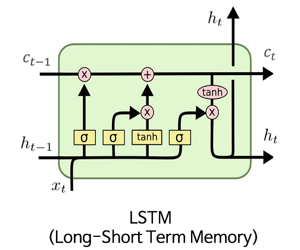
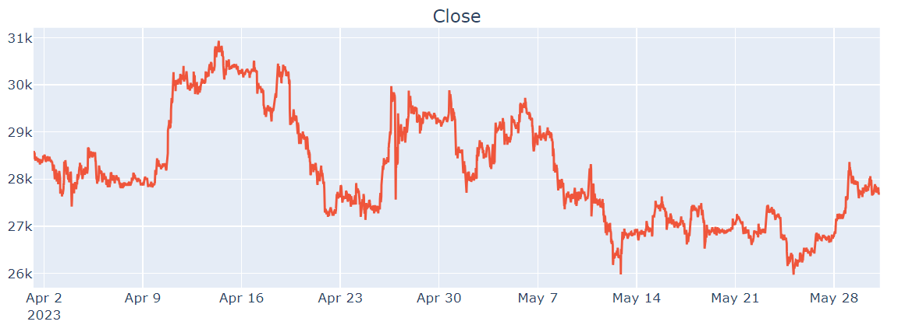
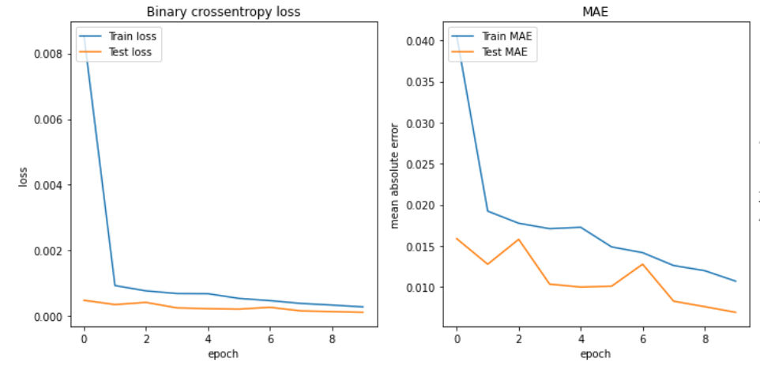
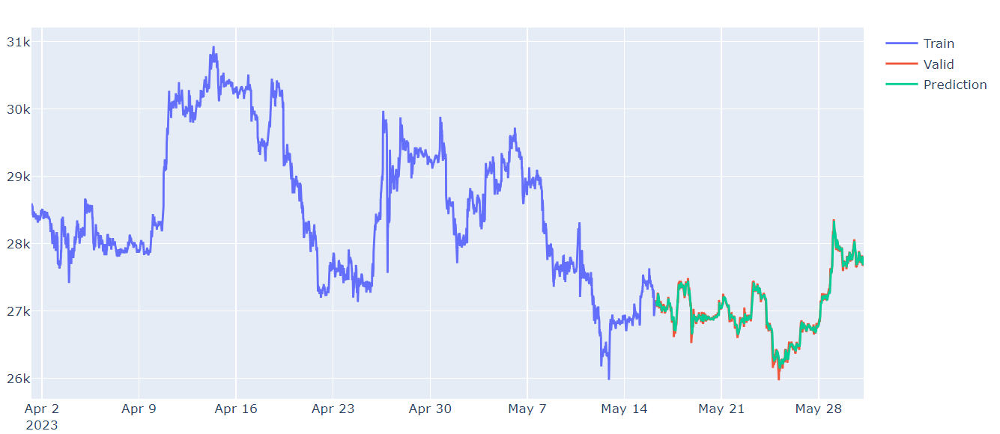
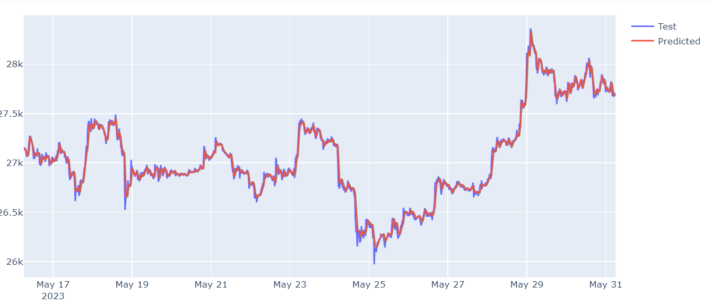
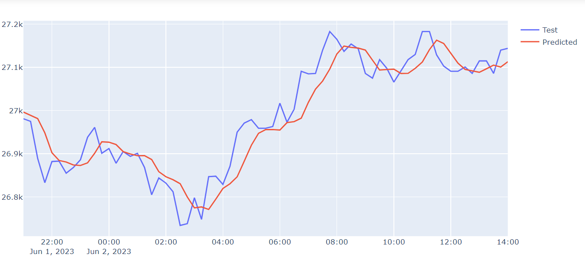

# Bitcoin - close price prediction with LSTM

### Project
The goal of this project was to predict Bitcoin close price with LSTM Network.

This is my first adventure with time series forecasting. I wanted to try my hand at this topic, for this reason, I used the well-known LSTM architecture for modelling
 

### Dataset
For the experiment, I used data scrapped from the www.bitfinex.com.

The function `download_data()` allowing for data scrapping is in the `get_data` module. It allows you to download a set of data from a specific date range and with an appropriate time interval (1m, 5m, 15m... etc). In addition, it takes into account the time zone that the user provides.

The data (5761 observations) were divided into training and test sets. The first 4321 (01.04.2023 - 05.16.2023) observations are the training set, the rest are the test set (16.05.2023-31.05.2023). Below you can see this time series.
 

### Training
For training, the data was divided into batches of size 60. Based on this time window, the next observation (closing price) was predicted. Thus, the input of the neural network was a sequence consisting 60 values of bitcoin price. The output is the next predicted value. 
The learning process is presented in the graphs below.
 

The chart below shows what our network has learned.
 

Below evaluation only on test data:
 

### Out-of-time evaluating
 

